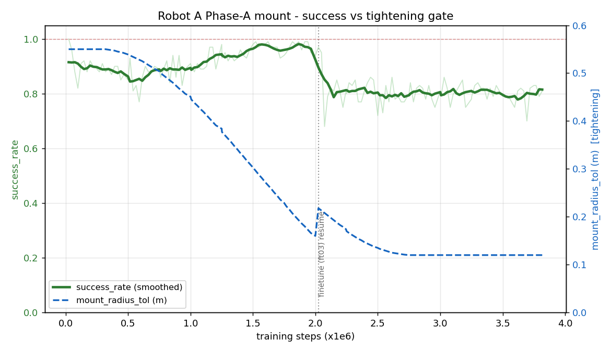
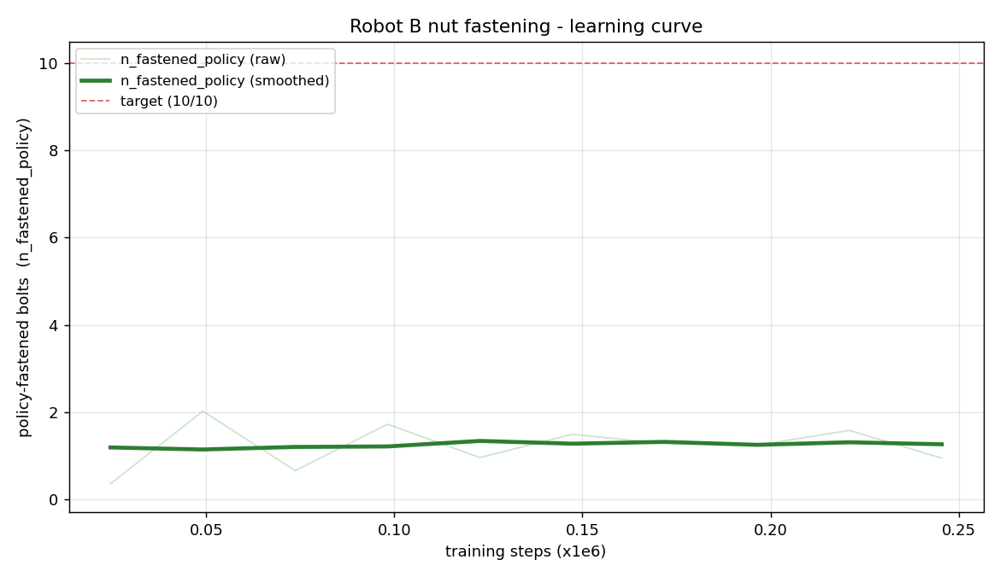

# TYRO 이중 로봇 강화학습 — 전체 학습 보고서

> **작성일:** 2026-06-08  
> **프로젝트:** TYRO — 듀얼암 타이어 마운팅 시뮬레이션 + PPO 학습  
> **대상:** Robot A (FANUC R2000iC) Phase A 마운트 · Robot B (UR10e+너트러너) 볼트 체결

> 본 보고서는 **현재 최신 모델** 기준으로 작성되었습니다. 두 로봇 모두 동일한
> **Min-Jerk 명목 궤적 + PPO 잔차** 구조를 사용합니다.

---

## 목차

1. [프로젝트 개요](#1-프로젝트-개요)
2. [시뮬레이션 환경](#2-시뮬레이션-환경)
3. [물체 모델링](#3-물체-모델링)
4. [씬 레이아웃 및 좌표계](#4-씬-레이아웃-및-좌표계)
5. [로봇 모델 및 제어](#5-로봇-모델-및-제어)
6. [관측 공간 (Observation)](#6-관측-공간-observation)
7. [액션 공간 (Action)](#7-액션-공간-action)
8. [제어 구조 — Min-Jerk Planner + PPO Residual](#8-제어-구조--min-jerk-planner--ppo-residual)
9. [Robot A — Phase A 타이어 마운트 학습](#9-robot-a--phase-a-타이어-마운트-학습)
10. [Robot B — 너트 체결 학습](#10-robot-b--너트-체결-학습)
11. [PPO 학습 설정 (공통)](#11-ppo-학습-설정-공통)
12. [커리큘럼 및 도메인 랜덤화](#12-커리큘럼-및-도메인-랜덤화)
13. [종료 조건 및 안전 게이트](#13-종료-조건-및-안전-게이트)
14. [학습 파이프라인 및 실행 방법](#14-학습-파이프라인-및-실행-방법)
15. [설계 근거 (명목 궤적 + 잔차)](#15-설계-근거-명목-궤적--잔차)
16. [현재 결과 및 향후 계획](#16-현재-결과-및-향후-계획)

---

## 1. 프로젝트 개요

### 1.1 목표

두 대의 산업용 로봇이 협동하여 **트럭 휠 허브에 타이어를 마운트하고 볼트를 체결**하는 작업을 강화학습으로 학습한다.

| 단계 | 로봇 | 작업 | 상태 |
|------|------|------|------|
| **Phase A** | Robot A (FANUC) | 타이어 픽업 → 허브 마운트 → 지지 | ✅ 학습 완료 (best 모델) |
| **Phase A'** | Robot B (UR10e) | A가 지지하는 동안 10개 볼트 순차 체결 | 🔄 학습 중 (플래너+잔차) |
| **Phase B** | A + B | 6단계 풀사이클 (픽업→마운트→복귀→재파지→디마운트→거치) | ⏳ 대기 |

> **공통 구조:** 두 로봇 모두 **명목 궤적(Min-Jerk 플래너) + PPO 잔차**로 제어한다.
> 충돌-free 명목 경로를 깔고 정책은 그 위 미세 보정(±cm)만 학습하므로, 정책이 장거리
> 경로를 자력 탐색할 필요가 없다(§8, §15).

### 1.2 기술 스택

| 항목 | 값 |
|------|-----|
| 시뮬레이터 | PyBullet |
| 알고리즘 | PPO (Proximal Policy Optimization) |
| 프레임워크 | Stable-Baselines3 |
| 정책 네트워크 | MlpPolicy `[256, 256]` |
| 언어 | Python 3.10 |
| 환경 | conda `tyro` |

### 1.3 전체 작업 흐름

```
[타이어 거치] ──S0 픽업──→ [A가 타이어 잡음]
                              │
                         S1 운반/마운트
                              │
                         [타이어 허브 안착] ──→ [A가 타이어 지지 (frozen)]
                                                    │
                                              B가 10개 볼트 순차 체결
                                                    │
                                              [체결 완료 = 에피소드 성공]
```

---

## 2. 시뮬레이션 환경

### 2.1 물리 파라미터

| 파라미터 | 값 | 설명 |
|----------|-----|------|
| `sim_freq_hz` | **240 Hz** | 물리 시뮬레이션 주파수 |
| `control_freq_hz` | **20 Hz** | 정책 제어 주파수 (decimation = 12) |
| `physics_num_sub_steps` | **12** (fanuc_spacious) | 서브스텝 수 (무거운 타이어 안정성) |
| `contact_erp` | 0.2 | 접촉 Error Reduction Parameter |
| `contact_cfm` | 2e-5 | Constraint Force Mixing |
| `gravity` | (0, 0, −9.81) m/s² | |
| `max_steps` | 600 (Phase A) / 600 (nut) | 에피소드 최대 스텝 (≈30초) |

### 2.2 환경 구성 요소

| 요소 | 타입 | 설명 |
|------|------|------|
| 바닥 | 무한 평면 + pit rim | 로봇 베이스 아래 pit 구조 |
| 허브 | 실린더 + 볼트 | ø420mm 플랜지, 10개 볼트 돌출 |
| 타이어 | 복합 multibody | 트레드 링 + 휠 디스크 (10개 lug hole) |
| **카고/차량 본체** | 정적 box + 휠웰 컷아웃 | 트럭 섀시, 작업공간 제약 + 진입 통로 |
| **카고 백월** | 정적 슬랩 | 타이어 허브 관통 방지 |
| 타이어 거치대 | 2개 정적 블록 | V-cradle (Y-split) |
| Robot A | URDF (FANUC) | 6-DOF + wheel gripper |
| Robot B | URDF (UR10e + nut tool) | 6-DOF + 30cm 너트러너 소켓 |

---

## 3. 물체 모델링

### 3.1 타이어 + 휠 디스크

실제 메시(STL) 대신 **프리미티브(box/cylinder) 조합**으로 모델링한다. PyBullet의 compound shape 제한(~16개/body)을 고려하여 multi-link 구조를 사용한다.

| 파라미터 | 값 | 설명 |
|----------|-----|------|
| `tire_outer_radius` | **0.525 m** | 외경 (295/80R22.5 근사) |
| `tire_inner_radius` | **0.282 m** | 보어(허브 pilot) 내경 |
| `tire_thickness` | **0.30 m** | 트레드 두께 (보어축 방향) |
| `tire_mass` | **100 kg** (heavy) | fanuc_spacious에서 heavy 모드 |
| `tire_inertia_heavy` | (18, 32, 32) kg·m² | 명시적 관성 (Bullet 자동 추정 방지) |
| `tire_hollow_collision` | True | 속이 빈 트레드 링 (실린더 아님) |
| `tire_annulus_collision_segments` | 16 | XY 평면 box 타일링 수 |

**트레드 링:** `tire_annulus_boxes()` — XY 평면에 N개 box를 원형 배치하여 속이 빈 링 형상 구현.

**휠 디스크:** `wheel_disk_three_boxes_per_hole()` — 10개 lug hole × 3 box(양쪽 flank + inner sill) = 30개 silver box. lug hole clearance를 물리적으로 표현.

**스폰 자세:** 수직 (보어축 = 월드 +X), V-cradle 거치대 위에 안착. 위치 `(-1.90, 0.0, 0.3913)`.

### 3.2 허브 (Hub)

| 파라미터 | 값 | 설명 |
|----------|-----|------|
| `hub_radius` | **0.21 m** | ø420mm 플랜지 |
| `hub_thickness` | **0.06 m** | 플랜지 두께 |
| `hub_pos_nominal` | (0, 0, 0) | fanuc_spacious: **허브 = 월드 원점** |
| `hub_base_rpy` | (0, −π/2, π/2) | 보어축 → 월드 −Y |
| `hub_axis_world` | (0, −1, 0) | 허브 법선 = 월드 −Y |

### 3.3 볼트 (Studs)

| 파라미터 | 값 | 설명 |
|----------|-----|------|
| `n_bolts` | **10** | lug circle 상 균등 배치 |
| `bolt_circle_radius` | **0.1675 m** | PCD (Pitch Circle Diameter) |
| `bolt_length` | **0.10 m** | 스터드 길이 (허브면 → 자유단) |
| `bolt_radius` | **0.011 m** | ø22mm (M22 스터드 근사) |
| 볼트 축 방향 | **월드 −Y** | 허브면에서 Robot B 방향으로 돌출 |
| 볼트 간 피치 | **≈10.4 cm** | 원주 ÷ 10 |

> **중요:** 10개 볼트 모두 동일한 축 방향(−Y)을 가지며, Robot B의 너트러너 공구 +Z가 이 축에 정렬되어야 체결 가능.

### 3.4 카고 / 차량 본체 (Cargo / Vehicle Body)

허브는 단독으로 떠 있지 않고 **트럭 섀시(카고 박스)에 장착**된 형태로 모델링한다. 카고는 (1) 작업 공간을 물리적으로 제약하고, (2) 휠 웰(wheel-well) 컷아웃으로 타이어 진입 통로를 만들며, (3) 타이어가 허브를 관통해 차량 내부로 밀려 들어가지 않도록 막는다.

#### 3.4.1 카고 박스 (Vehicle Primitive Box)

| 파라미터 | 값 (fanuc_spacious) | 설명 |
|----------|---------------------|------|
| `spawn_vehicle_primitive_box` | True | 카고 박스 활성 |
| `vehicle_half_extents` | (0.25, 1.0, 0.5) m | local 반치수 |
| `vehicle_base_rpy` | (0, 0, +π/2) | yaw +90° → 섀시가 X 주행축에 정렬 |
| `vehicle_center_world` | **(0.0, 0.25, 0.56)** | 허브(원점) 뒤·위로 추적 |
| 월드 footprint | 2.00 m (X) × 0.50 m (Y) × 1.00 m (Z) | 회전 후 |

> yaw +π/2로 인해 local Y(2m) → 월드 X(긴 섀시), local X(0.5m) → 월드 Y(두께). 카고의 −Y 면이 허브 플랜지 평면과 마주본다(실제 트럭처럼 허브 양옆을 감쌈).

#### 3.4.2 휠 웰 컷아웃 (Wheel-Well Cutout)

타이어가 진입할 수 있도록 카고 면에 **아치형 개구부**를 뚫는다.

| 파라미터 | 값 | 설명 |
|----------|-----|------|
| `cargo_use_wheel_well_cutout` | True | 컷아웃 활성 |
| `cargo_wheel_well_axis` | "y" | 허브축(−Y)과 동축 |
| `cargo_wheel_well_radius` | 0.85 m | 아치 반경 |
| `cargo_wheel_well_radius_yz` | 0.85 m | YZ 평면 반경 |
| `cargo_wheel_well_along_range_from_hub` | (−0.50, 0.50) | 허브 기준 축방향 범위 |
| `cargo_wheel_well_x_range_from_hub` | (−0.65, 0.85) | 허브 기준 X 범위 |
| `cargo_collision_subdiv` | (1, 6, 3) | local (nx, ny, nz) 분할 |

> 컷아웃 구현: 카고를 6×3 셀로 분할(subdiv)한 뒤, 휠 웰 실린더가 지나는 중앙·하단 셀을 제거 → **양쪽 기둥(pillar) + 지붕(roof)** 구조가 남아 타이어 둘레로 아치가 열린다.

#### 3.4.3 카고 백월 (Cargo Back Wall)

타이어가 허브 플랜지를 **관통해 차량 내부로 밀려 들어가는 것을 방지**하는 별도 정적 슬랩. (PyBullet compound primitive 한계를 피하기 위해 독립 body로 구성.)

| 파라미터 | 값 (fanuc_spacious) | 설명 |
|----------|---------------------|------|
| `spawn_cargo_back_wall` | True | 백월 활성 |
| `cargo_back_wall_y_offset` | **0.35 m** | 허브 중심에서 +Y 오프셋 |
| `cargo_back_wall_half_extents` | (1.0, 0.02, 0.50) m | 얇은 슬랩 (Y 두께 2cm) |
| `cargo_back_wall_center_z` | **0.56 m** | 카고 바닥과 정렬 |
| `cargo_back_wall_rgba` | (0.45, 0.30, 0.30, 1.0) | 갈색 |

> **물리적 역할:** 타이어가 마운트될 때 far face가 hub_y + 0.15에 도달. 백월은 그보다 더 뒤(허브 +0.35)에 위치하여, 마운트 시 약간의 overshoot은 허용하되 실제 관통은 막는다. `_sync_grasped_tire_upright`의 카고 관통 가드와 함께 작동 — kinematic 업데이트가 타이어를 카고/백월로 밀어넣으려 하면 마지막 안전 pose로 되돌린다.

#### 3.4.4 카고 충돌 처리

| 검사 대상 | 방식 |
|-----------|------|
| 로봇 arm ↔ 카고 | `_in_bad_collision` (충돌 페널티 / 종료) |
| kinematic 타이어 ↔ 카고/백월 | `_sync_grasped_tire_upright` penetration guard (안전 pose 복원) |
| Stage 1 carry arch | 0.35 m (카고 바닥 클리어) |

> **주의:** Robot B 너트 체결 task에서는 `collision_terminates=False` + socket↔hub/tire 필터로 충돌 종료를 끄지만, 카고 박스/백월은 정적 구조물로 씬에 그대로 존재한다.

### 3.5 타이어 거치대 (Tire Rack)

Phase A에서 타이어를 수직으로 지지하는 V-cradle.

| 파라미터 | 값 (fanuc_spacious) | 설명 |
|----------|---------------------|------|
| `tire_rack_half_extents` | (0.10, 0.05, 0.025) m | 레일 반치수 |
| `tire_rack_inner_center` | (−2.20, −1.10, −0.716) | 안쪽 레일 |
| `tire_rack_outer_center` | (−2.20, −1.90, −0.716) | 바깥 레일 |
| `tire_rack_support_posts` | True | 지지 기둥 |
| 구조 | Y-split V-cradle | 두 레일 위에 타이어 트레드가 안착 |

### 3.6 Robot B 너트러너 도구

| 파라미터 | 값 | 설명 |
|----------|-----|------|
| URDF | `ur10e_with_nut_tool.urdf` | UR10e + 30cm 소켓 extension |
| `ur10e_nut_tool_length` | **0.30 m** | 플랜지 → tool_tip |
| tool_tip | `tool_tip` link | IK/관측의 EE 기준점 |
| 공구 +Z 방향 | **월드 +Y** (= 볼트축 반대) | 소켓이 볼트를 향해 삽입 |

---

## 4. 씬 레이아웃 및 좌표계

### 4.1 fanuc_spacious 레이아웃

```
                    +X (Robot A 방향)
                     ↑
                     │
    [타이어 거치] ←──┼──→ [허브 (원점)]
    (-1.9, 0, 0.39)  │
                     │
    ─────────────────┼─────────────→ +Y
                     │
                     ↓
              [Robot B base]
              (0.90, -0.95, -0.30)
                     │
                     ↓ −Y (볼트 축)
```

| 요소 | 월드 좌표 (x, y, z) | 비고 |
|------|---------------------|------|
| **허브 중심** | (0, 0, 0) | **월드 원점 = obs 기준점** |
| Robot A base | fanuc_spacious 오프셋 적용 | 대형 6축 |
| Robot B base | (0.90, −0.95, −0.30) | UR10e + 30cm tool |
| 타이어 거치 | (−1.90, 0.0, 0.3913) | V-cradle 위 |
| 볼트 0 | (0, −0.08, +0.168) | 12시 방향 |
| 볼트 4 | (−0.10, −0.08, −0.136) | 8시 방향 (먼 호) |

### 4.2 좌표계 규약

- **관측 기준점:** `obs_reference_pos = (0, 0, 0)` = 허브 중심
- **모든 위치 관측:** `body_pos − obs_reference_pos` (허브 기준 상대 좌표)
- **볼트 축:** 월드 −Y (모든 볼트 동일)
- **Robot B HOME EE:** (1.591, −0.776, 0.077) — 볼트 0까지 ≈1.7m

---

## 5. 로봇 모델 및 제어

### 5.1 Robot A — FANUC R2000iC

| 항목 | 값 |
|------|-----|
| URDF | `r2000ic210f_wheeltool.urdf` (wheel gripper 부착) |
| DOF | 6 (shoulder_pan, shoulder_lift, elbow, wrist_1/2/3) |
| EE link | `ee_link` |
| Palm-up lock | **ON** (tool +Z = world +Z) |
| Motor max velocity | 1.4 rad/s |
| Torque scale | 1.5× |
| Position/velocity gain | 0.85 / 1.15 |
| Post-step palm-up enforcement | ON (threshold 0.9998) |

**타이어 운반:** kinematic tire lock — 매 스텝 타이어 pose를 EE+offset으로 직접 설정. 100kg 타이어를 PD로 끌면 arm이 saturation되어 마운트 도달 불가 → kinematic teleport로 해결.

### 5.2 Robot B — UR10e + Nut Runner

| 항목 | 값 |
|------|-----|
| URDF | `ur10e_with_nut_tool.urdf` |
| DOF | 6 |
| EE link | `tool_tip` (소켓 끝) |
| Palm-up lock | **OFF** (자유 orientation, roll-free IK) |
| Motor forces (default) | [400, 400, 300, 60, 60, 60] N·m |
| Motor forces (nut task) | **[6000, 6000, 4000, 1000, 1000, 1000] N·m** |
| IK warm-start | **현재 관절** (nut task, branch continuity) |

> **중요 (중력 sag 대응):** 먼 호 볼트(4~6)에서 arm이 거의 완전히 뻗은 자세 → elbow 중력 토크 > 기본 300 N·m → arm sag 36.8cm. nut task에서 force cap을 20× 상향하여 해결(§15.1).

---

## 6. Observaton (관측 공간)

### 6.1 Phase A (Robot A 마운트) — 85차원

| 채널 | 차원 | 설명 |
|------|------|------|
| qA (normalized) | 6 | Robot A 관절 위치 [−1, 1] |
| dqA (normalized) | 6 | Robot A 관절 속도 |
| qB (normalized) | 7 | Robot B 관절 (frozen, 0으로 마스킹) |
| dqB (normalized) | 7 | Robot B 관절 속도 (frozen) |
| eeA_pos / ws | 3 | A EE 위치 (허브 기준) |
| eeA_orn | 4 | A EE quaternion |
| eeB_pos / ws | 3 | B EE 위치 (frozen, 마스킹) |
| eeB_orn | 4 | B EE quaternion (frozen) |
| tire_pos / ws | 3 | 타이어 COM 위치 |
| tire_orn | 4 | 타이어 quaternion |
| hub_pos / ws | 3 | 허브 중심 위치 |
| hub_orn | 4 | 허브 quaternion |
| bolt_pos / ws | 3 | 현재 타겟 볼트 위치 |
| bolt_orn | 4 | 볼트 quaternion |
| rel_th_pos / ws | 3 | 타이어→허브 위치 차 |
| rel_th_rot / π | 3 | 타이어→허브 회전 차 |
| rel_eb_pos / ws | 3 | B EE→볼트 위치 차 |
| rel_eb_rot / π | 3 | B EE→볼트 회전 차 |
| prev_action | 6 | 이전 스텝 액션 |
| mount_tail | 3 | (axial, lateral, lug_spin) 마운트 잔차 |
| hub_guide_vector | 3 | (hub − eeA) / ws — S1 운반 방향 cue |
| **합계** | **85** | |

### 6.2 Nut Task (Robot B) — 99차원 (85 + 7 + 7)

Phase A 85차원에 **7차원 nut 전용 채널** 추가:

| 채널 | 차원 | 설명 |
|------|------|------|
| vec_to_staging / ws | 3 | (staging_point − tool_tip) / ws — 접근 목표 벡터 |
| bolt_axis_unit | 3 | 볼트 축 단위벡터 (월드 −Y) |
| theta_normalized | 1 | tool +Z ↔ bolt axis angle / (π/2) |

> Robot A 채널은 nut task에서 **frozen + 마스킹**(0으로 zero-out). Robot B만 학습.

---

## 7. Action (액션 공간)

### 7.1 Phase A — 6차원

| 채널 | 범위 | 스케일 | 설명 |
|------|------|--------|------|
| Δpos_A [0:3] | [−1, 1] | × 0.03 m | EE 위치 잔차 (planner 위에 추가) |
| Δrot_A [3:6] | [−1, 1] | × 0.05 rad | EE 회전 잔차 (planner lock 시 무시) |

### 7.2 Nut Task — 12차원, 실제 활성 3채널

| 채널 | 범위 | 스케일 | 설명 |
|------|------|--------|------|
| Δpos_A [0:3] | [−1, 1] | — | A frozen (마스킹, 보상 dead) |
| Δrot_A [3:6] | [−1, 1] | — | A frozen (마스킹) |
| **잔차_B [6:9]** | [−1, 1] | × **0.05 m** | **명목 EE 궤적 위 XYZ 잔차** (`nut_planner_pos_residual_scale`) |
| Δrot_B [9:12] | [−1, 1] | — | coaxial 락으로 dead (마스킹) |

> **잔차 구조:** `action[6:9]`는 **명목 궤적의 현재 점 위에 더하는 XYZ 잔차**다. 방향은
> 볼트축 coaxial로 하드 락(`nut_b_lock_coaxial`)되어 회전 채널 `[9:12]`은 죽고, A 채널
> `[0:6]`도 frozen이라 **실효 제어 자유도는 3 (XYZ)**. APPROACH(sub=0)에서만 적용하며
> MACRO(sub=1)는 환경이 직접 구동(정책 무시).

---

## 8. 제어 구조 — Min-Jerk Planner + PPO Residual

### 8.1 개요

```
┌─────────────────────────────────────────────────┐
│  FSM Stage Transition                            │
│  ┌───────────────────────────────────────────┐  │
│  │  Min-Jerk Planner                         │  │
│  │  current EE → stage end-pose              │  │
│  │  (5th-order position + SLERP orientation) │  │
│  │  → baked joint trajectory (200 steps)       │  │
│  └───────────────────────────────────────────┘  │
│                      ↓ nominal pose              │
│  ┌───────────────────────────────────────────┐  │
│  │  PPO Policy (residual)                    │  │
│  │  action ∈ [-1,1]^6 × scale(0.03m)        │  │
│  │  → nominal + residual = target EE pose    │  │
│  └───────────────────────────────────────────┘  │
│                      ↓                           │
│  ┌───────────────────────────────────────────┐  │
│  │  IK → joint targets → PyBullet motors     │  │
│  └───────────────────────────────────────────┘  │
└─────────────────────────────────────────────────┘
```

### 8.2 Planner 파라미터

| 파라미터 | 값 | 설명 |
|----------|-----|------|
| `use_planner_residual` | True | Master switch |
| `planner_pos_offset_scale` | **0.03 m** | 잔차 위치 스케일 (0.20→0.12→0.03 축소) |
| `planner_rot_offset_scale` | 0.15 rad | 잔차 회전 (lock mode에서 무시) |
| `planner_enable_rot_offset` | False | 회전 잔차 비활성 (pos_only) |
| `planner_lock_palm_up` | True | tool +Z = world +Z 강제 |
| `planner_lock_palm_up_stages` | (0,1,2,3) | 전 스테이지 palm-up |
| `planner_traj_steps` | 200 | baked trajectory 길이 |
| `planner_waypoint_gate_enable` | False | EE 도착 게이트 (FANUC: OFF) |

### 8.3 Palm-up Tilt-Lock

- **목적:** 타이어가 수직 자세를 유지하도록 공구 +Z = world +Z 강제
- **방식:** planner가 SLERP로 yaw만 허용, pitch/roll은 world +Z에 고정
- **post-step enforcement:** `fanuc_enforce_palm_up_post_step` — 매 step 후 tool +Z 재정렬 (threshold 0.9998)
- **Stage 1 carry arch:** 0.35m (base column clearance)

---

## 9. Robot A — Phase A 타이어 마운트 학습

### 9.1 FSM (4-Stage)

```
S0 (Approach)  ──pickup──→  S1 (Carry/Mount)  ──mount──→  S2 (Demount)  ──demount──→  S3 (Return)
  EE → 타이어 6시          타이어 → 허브           허브에서 인출           크래들 복귀
  그립 anchor               동축 마운트              축방향 pull             소프트 안착
  R_pickup=300              R_mount=300              R_demount=150           R_success=300
```

### 9.2 마운트 게이트

| 게이트 | 소프트 (시작) | 하드 (최종) | 램프 |
|--------|-------------|------------|------|
| 반경 (`mount_radius_tol`) | 0.55 m | 0.12 m | 2.5M step |
| 각도 (`mount_angle_tol`) | 45° | 5° | 2.5M step |

> 소프트 게이트(0.55m)는 `planner_stage1_approach_standoff`(0.70m)보다 **좁게** 설정하여, coaxial insertion segment(+Y leg)가 먼저 실행되도록 강제.

### 9.3 보상 구조

#### Dense (매 step, mix_dense=0.3)

| Stage | 보상 항 | 가중치 | 설명 |
|-------|---------|--------|------|
| S0 | `w_approach × exp(−d/decay)` | 3.0 / 0.15m | EE→그립 anchor 접근 |
| S0 | `w_approach_close × exp(−d/decay)` | 2.0 / 0.2m | 근거리 보너스 |
| S0 | `w_pb_approach × Δd` | 5.0 | Potential-based shaping |
| S1 | `w_guide × exp(−‖hub−ee‖/decay)` | 8.0 / 0.5m | EE→허브 벡터 유도 |
| S1 | `w_pb_carry × Δd_A` | 10.0 | 타이어→허브 거리 PB |
| S2 | `w_pull_demount × (1−exp(−d/decay))` | 3.0 / 0.2m | 디마운트 인출 |
| S2 | `w_pb_demount × Δd_hub` | 20.0 | 허브 이탈 PB |
| S3 | `w_return × exp(−d/decay)` | 3.0 / 0.5m | 크래들 복귀 |
| S3 | `w_pb_return × Δd` | 30.0 | 복귀 PB |
| All | `w_vertical × err` | 1.0 | 타이어 수직 유지 |
| All | `w_step_alive` | 0.15/step | hover 방지 |
| All | `w_collision` | 10.0 | 충돌 페널티 |
| All | `w_sync_joint_a` | 0.005 | A 관절 속도 페널티 |

#### Sparse (FSM 이벤트, mix_sparse=0.7)

| 이벤트 | 보너스 |
|--------|--------|
| R_pickup (S0→S1) | +300 |
| R_mount (S1→S2) | +300 |
| R_demount (S2→S3) | +150 |
| R_success (S3→Done) | +300 |
| R_fail (실패 종료) | −50 |

### 9.4 학습 설정

#### Phase A 초기 학습 (`run_phase1_pipeline.sh`)

```bash
python -u -m src.train \
  --stage 3 --phase 1 --scene-layout fanuc_spacious \
  --num-envs 72 --n-steps 341 --batch-size 1024 \
  --device cpu --log-std-init -0.5 \
  --start-pos-easy-prob-schedule-mid 0.7 --...-end 0.6 \
  --mount-radius-soft 0.55 --mount-angle-soft-deg 45 \
  --mount-tol-ramp-steps 2500000 \
  --total-steps 2000000 --run-name phase1_mount_v2
```

#### Phase A 파인튜닝 (`run_phase1_mount_ft03.sh`)

```bash
python -u -m src.train \
  --stage 3 --phase 1 --scene-layout fanuc_spacious \
  --num-envs 72 --n-steps 341 --batch-size 1024 \
  --device cpu --log-std-init -0.5 \
  --start-pos-easy-prob-schedule-mid 0.85 --...-end 0.8 \
  --mount-radius-soft 0.55 --mount-angle-soft-deg 45 \
  --mount-tol-ramp-steps 2500000 \
  --total-steps 3000000 --run-name phase1_mount_v2_ft03 \
  --resume runs/phase1_mount_v2/best/best_model.zip \
  --resume-mode full
```

**결과:** 수렴, best 모델 확보. 결정론적 eval에서 타이어 중심 d ≈ 0 (~0.4 cm) 허브 안착.

---

## 10. Robot B — 너트 체결 학습

### 10.1 태스크 정의

- Robot A가 **학습된 mount-end pose**로 타이어를 지지 (frozen, 매 step joint target 재구동)
- Robot B가 **10개 볼트를 순차적으로** 체결 (0→1→...→9)
- **기하학적 충실도만:** 너트 바디/토크 없음, 동축 접근 + 삽입 + 유지 + 후퇴
- **볼트 축 = 월드 −Y:** 공구 +Z를 볼트축에 정렬하여 Y축으로 진입

### 10.2 환경 설정 (nut_fastening_task)

| 설정 | 값 | 설명 |
|------|-----|------|
| `nut_fastening_task` | True | 마스터 스위치 |
| `freeze_robot_b` | **False** (override) | B 학습 활성 |
| `collision_terminates` | **False** (override) | 기하 체결, 충돌 종료 OFF |
| `contact_force_terminate_above` | **0.0** (override) | 접촉력 종료 OFF |
| `nut_mount_endpose_path` | `data/nut_mount_endpose.npz` | A 지지 자세 (학습된) |
| `nut_a_hold_jitter_rad` | 3° | A 자세 jitter (강건성) |

### 10.3 2-Phase 서브 FSM

```
┌─────────────────────────────────────────────────────────┐
│  APPROACH (sub=0) — 명목 궤적 + PPO 잔차                 │
│  ┌─────────────────────────────────────────────────┐    │
│  │  명목: Min-Jerk 궤적 (현재→허브중앙→staging,     │    │
│  │        볼트 간은 XZ hop) → joint-space로 IK 체인  │    │
│  │  정책: action[6:9] × 0.05 m XYZ 잔차만 (3-DOF)   │    │
│  │  방향: 볼트축 coaxial 하드 락 (θ ≈ 0 항상)        │    │
│  │  게이트: d_stage < 8cm AND θ < ang_tol → MACRO   │    │
│  └─────────────────────────────────────────────────┘    │
│                      ↓ arrive gate                       │
│  MACRO (sub=1) — 환경 스크립트 (정책 무시)               │
│  ┌─────────────────────────────────────────────────┐    │
│  │  INSERT: joint-space lerp → hub face (base)     │    │
│  │  HOLD: 6 step dwell                             │    │
│  │  RETRACT: joint-space lerp → bolt tip + clear   │    │
│  │  → bolt fastened → 다음 볼트 명목 궤적 재생성     │    │
│  └─────────────────────────────────────────────────┘    │
│                      ↓ all 10 done                       │
│  SUCCESS (all_fastened) → R_all_fastened                  │
└─────────────────────────────────────────────────────────┘
```

> **명목 궤적 생성 (`_generate_nut_approach_traj`):**
> - 첫 볼트: `[현재 EE, 허브 링 중앙(0,−0.21,0), staging]` 3-웨이포인트 Min-Jerk
> - 볼트 → 볼트: `[현재 EE, XZ hop(Y=이전 retract Y 고정), staging]` (순수 XZ transit)
> - Cartesian min-jerk 경로를 `_ik_b_rollfree`로 **관절공간 궤적으로 변환**(branch-stable).
>   잔차=0이면 관절 lerp를 직접 구동, 잔차≠0이면 명목 관절로 reset 후 EE에 잔차를 더해 IK.
> - reset 시 + 매 볼트 체결 후 재생성. 명목 궤적이 HOME→볼트 접근을 담당하므로 hot-start 발판은 불필요.

### 10.4 Scripted Macro 상세

| 파라미터 | 값 | 설명 |
|----------|-----|------|
| `nut_scripted_macro` | True | 매크로 활성 |
| `nut_arrive_pos_tol` | **0.08 m** | 캡처 구 (staging point 거리) |
| `nut_arrive_steps` | 1 | 연속 in-gate step (1이면 즉시 트리거) |
| `nut_hold_steps` | 6 | INSERT 후 dwell |
| `nut_macro_step_m` | 0.04 m | 매크로 leg stride |
| `nut_macro_leg_max_steps` | 30 | leg timeout |
| `nut_insert_margin` | 0.03 m | staging을 더 바깥으로 (긴 plunge) |
| `nut_retract_clear` | 0.03 m | retract 추가 클리어 |

**Macro 실행:** joint-space lerp (q_from → q_to, leg_len steps). Roll-free IK로 leg endpoint를 reset 시 1회 precompute + cache. 물리 contact 없이 기하학적 슬라이드.

### 10.5 보상 구조 — farm-proof PB + corridor

정책의 역할을 **명목 궤적 위 미세 보정 + 충돌 회피**로 한정한다. 따라서
"주차해서 빨아먹을 수 있는" standing 양수 커널(align/reach/lateral/axial/path)을
**전부 0으로 제거**하고, 전진에만 보상이 붙는 potential-based shaping(PB)과 페널티만 남긴다.

#### APPROACH 단계 (sub=0) — dense

| 항목 | 공식 | 가중치/파라미터 | 설명 |
|------|------|----------------|------|
| **PB nut** | `w × (d_prev − d_now)` | w=**25** | staging까지 유클리드 거리 감소분만 보상 (farm 불가) |
| **Corridor 페널티** | `−w × max(0, Y_excursion)` | w=**8.0**, margin 0.02 m | staging 평면보다 허브쪽(+Y)으로 넘어가면 선형 페널티 |
| (standing 커널) | — | **0** | align/reach/lateral/axial/path 전부 제거 |

> **standing 커널 제거 이유:** `exp(−거리)` 형태의 항상-양수 보상은 정책이 볼트 옆
> ~12 cm에 주차해 per-step income을 빨아먹는 farm을 만든다(체결보다 이득). PB만 남기면
> "전진해야만 보상"이 되고, 명목 궤적이 경로 자체를 제공하므로 standing 커널 없이도 접근이 성립한다.

#### Sparse (FSM 이벤트)

| 이벤트 | 보너스 | 설명 |
|--------|--------|------|
| R_arrive (staging 도달 → macro 트리거) | + | APPROACH 성공 |
| R_insert (INSERT+HOLD 완료) | + | 삽입 |
| R_fasten (볼트 1개 체결) | + | 볼트당 |
| R_all_fastened (10개 전체) | ++ | 에피소드 성공 |

#### 페널티 (항상)

| 항목 | 공식 | 가중치 | 설명 |
|------|------|--------|------|
| **Collision** | `getContactPoints` A-B 접촉 | w=40.0 | 실제 표면 접촉(mesh-aware) |
| **Joint-vel** | `−w × ‖dq_B‖` | w=0.02 | 최소 관절변화 |
| Action / Jerk L2 | dead 채널 마스킹 | — | 활성 3채널(XYZ 잔차)만 |
| `ent_coef` | — | 0.008 | 탐험 |

### 10.6 커리큘럼

| 커리큘럼 | 설정 | 비고 |
|----------|---------|------|
| **Hot-start alpha** | **OFF** | 명목 궤적이 HOME→볼트 접근을 담당하므로 발판 불필요 |
| **Per-bolt random start** | **OFF** (항상 bolt 0 cold-start) | premark 인플레 제거, `n_fastened_policy` 정직 측정 |
| **Arrive angle tolerance** | 35° → 12° (hold 400k, ramp 2.0M) | 정렬 게이트 점진 강화 (coaxial 락이라 보조적) |

> **hot-start를 쓰지 않는 이유:** 명목 궤적이 항상 충돌-free 접근 경로를 제공하므로
> reverse-curriculum 발판 자체가 필요 없다 (`make_env_config`가 `nut_b_planner_residual=True`면
> `nut_b_hotstart_enable`을 자동 OFF).

### 10.7 물리 수정 (근본 원인 대응)

| 수정 | Before | After | 효과 |
|------|--------|-------|------|
| Motor force cap | [400,400,300,60,60,60] | **[6000,6000,4000,1000,1000,1000]** | sag 36.8→0~2.5cm |
| Self-collision filter | 없음 | nut_runner ↔ wrist links OFF | 16,300N 가짜 접촉 제거 |
| IK warm-start | HOME (arm.rest) | **현재 관절** | 먼 호 branch flip 방지 |
| Socket↔hub/tire filter | 없음 | B links ↔ hub/tire OFF | 동축 슬라이드 |
| Coaxial 방향 락 | Δrot 누적 | **볼트축 하드 락** | θ 표류(46°) 제거, 3-DOF로 축소 |

### 10.8 학습 설정 (`run_b_nut_train_v14.sh`)

```bash
python -u -m src.train \
  --stage 3 --phase 1 --scene-layout fanuc_spacious \
  --nut-fastening --nut-hold-steps 6 \
  --nut-b-planner-residual \
  --no-nut-hotstart-curriculum \
  --nut-arrive-ang-curriculum \
  --nut-arrive-ang-start-deg 35 --nut-arrive-ang-end-deg 12 \
  --nut-arrive-ang-hold-steps 400000 --nut-arrive-ang-ramp-steps 2000000 \
  --num-envs 88 --n-steps 279 --batch-size 1024 \
  --device cpu --eval-freq 250000 --eval-episodes 5 \
  --log-std-init -0.5 \
  --terminate-on never --max-steps 600 \
  --total-steps 3500000 --run-name nut_fastening_v14
```

| 플래너 CLI / config | 기본 | 설명 |
|------|------|------|
| `--nut-b-planner-residual` | False | 명목 궤적 + 잔차 모드 (hot-start 자동 OFF) |
| `nut_planner_pos_residual_scale` | 0.05 m | 잔차 XYZ 스케일 |
| `nut_planner_traj_steps` | 120 | 명목 궤적 leg당 샘플 수 |

> **검증:** `scripts/smoke_nut_planner_v14.py` — 잔차=0(명목만)으로 **10/10 체결** 확인
> (1592 step). 즉 명목 경로·FSM·매크로가 정책 없이도 전 볼트를 충돌-free로 체결 가능.

---

## 11. PPO 학습 설정 (공통)

| 파라미터 | 값 | CLI |
|----------|-----|-----|
| Algorithm | PPO | — |
| Policy | MlpPolicy | — |
| net_arch | [256, 256] | `--net-arch 256,256` |
| learning_rate | 3e-4 | `--lr 3e-4` |
| gamma | 0.995 | `--gamma 0.995` |
| gae_lambda | 0.95 | `--gae-lambda 0.95` |
| clip_range | 0.2 | `--clip-range 0.2` |
| ent_coef | 0.0 | `--ent-coef 0.0` |
| vf_coef | 0.5 | `--vf-coef 0.5` |
| max_grad_norm | 0.5 | `--max-grad-norm 0.5` |
| n_epochs | 10 | `--n-epochs 10` |
| n_steps | 341 | `--n-steps 341` |
| batch_size | 1024 | `--batch-size 1024` |
| log_std_init | −0.5 | `--log-std-init -0.5` |
| num_envs | 72 | `--num-envs 72` |
| device | CPU | `--device cpu` |
| eval_freq | 250,000 | `--eval-freq 250000` |
| eval_episodes | 5 | `--eval-episodes 5` |

> **CPU 선택 이유:** env collection이 wall-time의 ~98.6%. BLAS/OMP thread = 1로 설정하여 72개 SubprocVecEnv worker oversubscription 방지.

---

## 12. 커리큘럼 및 도메인 랜덤화

### 12.1 Robot A 커리큘럼

| 커리큘럼 | 파라미터 | 설명 |
|-----------|---------|------|
| **시작 위치 easy prob** | mid=0.85 → end=0.8 | 타이어가 허브 근처에서 시작할 확률 |
| **마운트 tol ramp** | soft(0.55m,45°) → hard(0.12m,5°) over 2.5M | 점진적 정밀도 요구 |
| **Attached hot-start** | 타이어 pre-attached | Stage 0 pickup skip, Stage 1부터 |

### 12.2 Robot B 커리큘럼

| 커리큘럼 | 파라미터 | 설명 |
|-----------|---------|------|
| **Hot-start alpha** | **OFF** | 명목 궤적이 접근 경로 제공 (발판 불필요) |
| **Per-bolt random start** | **OFF** | 항상 bolt 0 cold-start, 정직 지표 |
| **Arrive angle tol** | 35°→12° over 2.0M | 정렬 점진적 강화 (coaxial 락 보조) |

### 12.3 도메인 랜덤화 (Phase 2/3)

| Phase | 범위 | 설명 |
|-------|------|------|
| 1 | 0 cm | 고정 (현재) |
| 2 | ±2 cm | 허브/카고 XY jitter |
| 3 | ±5 cm | 더 넓은 jitter |

---

## 13. 종료 조건 및 안전 게이트

### 13.1 Robot A

| 조건 | 기본 | fanuc_spacious | 설명 |
|------|------|----------------|------|
| Success (mount) | `terminate_on=mount` | mount event | 마운트 완료 |
| Success (full) | `terminate_on=never` | landed event | 4-stage 완료 |
| Vertical violation | ON | ON (nut task: OFF) | 타이어 수직 이탈 (>15°) |
| Collision | OFF (penalty only) | OFF | per-step −10 페널티 |
| Workspace | ON | ON | EE workspace 이탈 |
| Contact force | 2500N / 50000N | 50000N | 과도 접촉력 |
| Max steps | 600 | 600 | timeout |

### 13.2 Robot B (Nut Task)

| 조건 | 값 | 설명 |
|------|-----|------|
| **Success** | all_fastened (10/10) | 전체 체결 |
| Collision | **OFF** | 기하 체결, socket↔hub/tire filtered |
| Contact force | **OFF** (0.0) | |
| Vertical | **OFF** | 타이어 mounted 상태 |
| Max steps | 600 | timeout |

---

## 14. 학습 파이프라인 및 실행 방법

### 14.1 전체 파이프라인

```
1. Robot A Phase A 학습 (2M step)
   └─ run_phase1_pipeline.sh → phase1_mount_v2/

2. Robot A 파인튜닝 (3M step, resume)
   └─ run_phase1_mount_ft03.sh → phase1_mount_v2_ft03/

3. A mount-end pose 추출
   └─ scripts/extract_mount_endpose.py → data/nut_mount_endpose.npz

4. Robot B nut fastening 학습 (3.5M step)
   └─ run_b_nut_train_v14.sh → nut_fastening_v14/
```

### 14.2 실행 방법

```bash
# 환경 준비
conda activate tyro
python scripts/poc_fanuc_urdf.py --fetch    # FANUC 메시
python scripts/fetch_ur10e.py --fetch          # UR10e 메시

# Robot A 학습
bash scripts/run_phase1_pipeline.sh          # 2M step
bash scripts/run_phase1_mount_ft03.sh          # 3M step finetune

# Robot B 학습 (플래너 + 잔차)
python scripts/smoke_nut_planner_v14.py        # 잔차=0 명목만으로 10/10 검증
bash scripts/run_b_nut_train_v14.sh            # 3.5M step

# 모니터링
tensorboard --logdir runs/ --port 6006
python scripts/plot_nut_progress.py            # 너트 체결 학습곡선 PNG 생성
```

### 14.3 체크포인트 위치

| Run | Best Model | Final |
|-----|-----------|-------|
| phase1_mount_v2 | `runs/phase1_mount_v2/best/best_model.zip` | `runs/phase1_mount_v2/final.zip` |
| phase1_mount_v2_ft03 | `runs/phase1_mount_v2_ft03/best/best_model.zip` | — |
| nut_fastening_v14 | `runs/nut_fastening_v14/best/best_model.zip` | (학습 중) |

---

## 15. 설계 근거 (명목 궤적 + 잔차)

현재 모델의 핵심 설계 — **"두 로봇 모두 명목 궤적 + PPO 잔차로 제어한다"** — 의
근거가 되는 4가지 원칙이다. 각 원칙은 단순 RL(정책이 모든 것을 자력 학습)이 부딪히는
구체적 실패 양상과, 그것을 구조적으로 제거하는 설계 결정으로 구성된다.

### 15.1 원칙 ① — 물리적 한계는 학습이 아니라 물리로 푼다

먼 호 볼트(4·5·6)는 UR10e가 거의 완전히 뻗은 자세에서 도달한다. 이때 elbow 정적 중력
토크가 기본 motor force cap(300 N·m)을 초과하면 arm이 staging pose를 못 버티고 EE가
36.8 cm sag → macro trigger 자체가 불가능하다. 이는 **보상/커리큘럼으로 해결할 수 없는
물리적 벽**이다.

**설계:** nut task motor force cap을 `[400,400,300,60,60,60]` →
`[6000,6000,4000,1000,1000,1000]` N·m으로 상향(B는 payload 없어 안전). sag 36.8→0~2.5 cm.

### 15.2 원칙 ② — 진척 지표는 정직해야 한다

reverse-curriculum이 앞 볼트를 미리 fastened로 표시(premark)하면 `n_fastened`가 부풀려져
실제 정책 성능과 무관해진다. **설계:** premark를 제외한 `n_fastened_policy` 지표 +
`eval/success_rate`로 측정하고, 항상 bolt 0 cold-start(random-bolt OFF)로 고정한다.

### 15.3 원칙 ③ — 보상은 farm 불가능해야 한다

`exp(−거리)` 형태의 항상-양수 standing 커널은 정책이 볼트 옆 ~12 cm에 주차해 per-step
income을 빨아먹는 farm을 만든다(체결보다 이득). 하나를 막으면 다른 커널이 새 farm
소득원이 되는 whack-a-mole이 발생한다. **설계:** standing 커널을 **전부 0**으로 하고,
전진분만 보상하는 potential-based shaping(PB) + corridor 페널티만 유지한다.

### 15.4 원칙 ④ — 장거리 reach는 RL에 맡기지 않는다 (핵심)

가장 결정적인 원칙. 정책이 HOME에서 볼트까지 **1.7 m를 자력 탐색**하게 두면 수렴하지
않는다. 그러나 충돌-free 경로 자체는 해석적으로 알려져 있다:

- `scripts/e2e_nut_oracle.py` — 볼트 순서 `(0,5,7,2,3,8,9,4,6,1)` + **XZ-only transit(Y 고정)**
  teleport oracle로 **10/10 체결, A-B 충돌 0** 증명. 경로·FSM·IK는 실행 가능하다.

**설계:** 이 oracle 경로를 **명목 궤적**으로 깔고(Robot A의 Min-Jerk 플래너와 동일 패턴),
정책은 그 위 ±5 cm XYZ 잔차만 학습한다. 방향은 coaxial 하드 락으로 표류를 차단한다.
잔차=0 스모크에서 명목만으로 10/10이 나오므로, 학습은 "경로 발견"이 아니라
**"충돌 회피 + 미세 정합"**이라는 훨씬 쉬운 문제로 축소된다.

### 15.5 핵심 교훈

> 두 로봇 모두 **장거리 reach를 RL의 자력 탐색에 맡기면 수렴하지 않는다.** 해석적으로
> 알 수 있는 충돌-free 경로는 명목 궤적으로 깔고, RL은 그 위 미세 보정만 배우게 하는 것이
> 프로젝트 전체를 관통하는 설계 원칙이다.

---

## 16. 현재 결과 및 향후 계획

### 16.1 Robot A (Phase A)

| 항목 | 결과 |
|------|------|
| 학습 | ✅ 수렴 (phase1_mount_v2 2.0M + ft03 3.84M, resume) |
| 마운트 정밀도 | d ≈ 0 (~0.4 cm), theta ≈ 0 |
| 게이트 커리큘럼 | 반경 0.55→**0.12 m**, 각도 45°→**5°** (하드 스펙 도달) |
| 성공률 | tol 0.55 m 구간 ~0.95, 하드 0.12 m/5° 구간 ~0.80 유지 |
| Best model | `runs/phase1_mount_v2/best/best_model.zip` |

#### 학습 곡선 — 성공률 vs 게이트 조임



**그래프 읽는 법.** 가로축은 학습 스텝(×10⁶), 두 개의 세로축을 쓴다.

| 요소 | 축 | 의미 |
|------|-----|------|
| 진한 초록 선 | 왼쪽 | `success_rate` 이동평균(7-window) — 마운트 성공 비율 |
| 연한 초록 선 | 왼쪽 | rollout별 raw `success_rate`(평활 전, 노이즈 포함) |
| 파란 점선 | 오른쪽 | `mount_radius_tol` — 마운트 성공으로 인정하는 거리 게이트(작을수록 엄격) |
| 빨강 점선 | 왼쪽 | 성공률 1.0 기준선 |
| 회색 세로 점선 | — | 파인튜닝 resume 지점(약 2.0M step) |

**해석.** 핵심은 **"게이트를 조여도 성공률이 무너지지 않는다"**는 점이다. 파란 점선이
0.55 m에서 시작해 커리큘럼을 따라 내려가는데(=요구 정밀도 상승), 그 동안 초록 선은
~0.95를 유지한다. 2.0M에서 파인튜닝을 resume하며 게이트를 **하드 스펙(0.12 m / 5°)**까지
끝까지 조이면 성공률이 ~0.95 → ~0.80으로 안착한다 — 정밀도 요구가 최고로 높아진 만큼의
합리적인 비용이며, 결정론적 eval에서는 타이어 중심 오차 ~0.4 cm로 허브에 안착한다.

> 재생성: `python scripts/plot_phase_a_progress.py` (`runs/phase1_mount_v2*.log` 파싱).

### 16.2 Robot B (Nut Fastening)

| 항목 | 결과 (2026-06-08 기준) |
|------|------------------------|
| **잔차=0 스모크** | **10/10 체결** (명목 궤적만, 1592 step) — `smoke_nut_planner_v14.py` |
| Oracle E2E | **10/10** 충돌-free (볼트 순서 + XZ transit, `e2e_nut_oracle.py`) |
| 학습 | 🔄 진행 중 — `n_fastened_policy` 상승 중 |
| 정직 지표 | `n_fastened_policy`, `eval/success_rate` (premark 제외) |

#### 학습 곡선 — 정책 체결 볼트 수



**그래프 읽는 법.** 가로축은 학습 스텝(×10⁶), 세로축은 `n_fastened_policy`
(정책이 한 에피소드에서 **스스로 체결한** 볼트 수, premark 제외 0~10).

| 요소 | 의미 |
|------|------|
| 진한 초록 선 | `n_fastened_policy` 이동평균(7-window) |
| 연한 초록 선 | rollout별 raw 값(노이즈 포함) |
| 빨강 점선 | 목표 10/10 (전 볼트 체결) |

**해석.** 명목 궤적이 충돌-free 접근 경로를 제공하므로, 정책은 "경로 발견"이 아니라
잔차 보정만 학습한다. 따라서 곡선은 학습 초반부터 0보다 위에서 출발해 우상향한다
(단순 RL은 같은 구간에서 0 부근을 벗어나지 못한다, §15.4). 학습이 진행될수록 곡선은
우측으로 연장되며 10/10 목표선을 향해 수렴하는 것을 모니터링한다.

> 재생성: `python scripts/plot_nut_progress.py` (최신 `runs/nut_fastening_*.log` 파싱).

### 16.3 향후 계획

1. **학습 모니터링** → `n_fastened_policy` / `eval success`가 10/10에 수렴하는지 확인
2. 수렴 후 **잔차 스케일 축소**(0.05→0.02)로 명목 경로 추종 강화 / 도메인 랜덤화 대비
3. **Phase B:** 6-stage full cycle (A+B 동시) — `--remount-cycle`
4. **Sim2Real:** domain randomization Phase 2/3, A 실 policy + B 협동
5. **통합 평가:** A mount → B nut → A hold → cycle repeat

---

## 부록 A: 파일 구조

```
TYRO/
├── src/
│   ├── config.py          # 모든 설정 (EnvConfig, RewardConfig, ...)
│   ├── train.py           # PPO 학습 CLI + curriculum callbacks
│   └── env/
│       ├── tyro_env.py    # 핵심 환경 (FSM, reward, obs, nut task)
│       ├── robots.py      # Robot A/B 클래스 (IK, motor control)
│       ├── scene.py       # 씬 빌드 (hub, tire, bolts, floor)
│       ├── models.py      # 타이어/휠 프리미티브 모델링
│       └── rewards.py     # RewardBreakdown dataclass
├── scripts/
│   ├── run_phase1_pipeline.sh      # A 초기 학습
│   ├── run_phase1_mount_ft03.sh    # A 파인튜닝
│   ├── run_b_nut_train_v14.sh      # B nut 학습 (플래너+잔차)
│   ├── smoke_nut_planner_v14.py    # 잔차=0 명목 궤적 10/10 검증
│   ├── e2e_nut_oracle.py           # teleport oracle 10/10 (경로 증명)
│   ├── plot_nut_progress.py        # B 너트 체결 학습곡선 PNG
│   ├── plot_phase_a_progress.py    # A 성공률 vs 게이트 PNG
│   ├── extract_mount_endpose.py    # A endpose 추출
│   └── preview_nut_fastening.py    # GUI 진단
├── data/
│   ├── urdf/              # 로봇 URDF (메시 별도 fetch)
│   └── nut_mount_endpose.npz  # A 지지 자세
└── runs/                  # 학습 로그 + 체크포인트
```

## 부록 B: 주요 설정 파일 위치

| 설정 | 파일 | 함수/클래스 |
|------|------|------------|
| 물리/씬/로봇 | `src/config.py` | `EnvConfig` |
| 보상 가중치 | `src/config.py` | `RewardConfig` |
| fanuc_spacious | `src/config.py` | `apply_fanuc_spacious_layout()` |
| nut task override | `src/config.py` | `make_env_config()` |
| 카고/차량/거치대 빌드 | `src/env/scene.py` | `Scene.build()` |
| 타이어/휠 프리미티브 | `src/env/models.py` | `create_tire_wheel_multibody()` |
| FSM/reward/obs | `src/env/tyro_env.py` | `TyroEnv` |
| PPO CLI | `src/train.py` | `main()` |

---

*본 문서는 TYRO 프로젝트의 Robot A Phase A 마운트 및 Robot B 너트 체결 학습에 사용된 모든 설정, 모델링, 보상, 커리큘럼, 디버깅 과정을 정리한 것입니다.*
